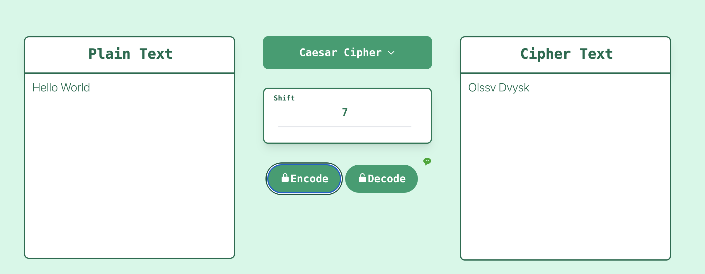
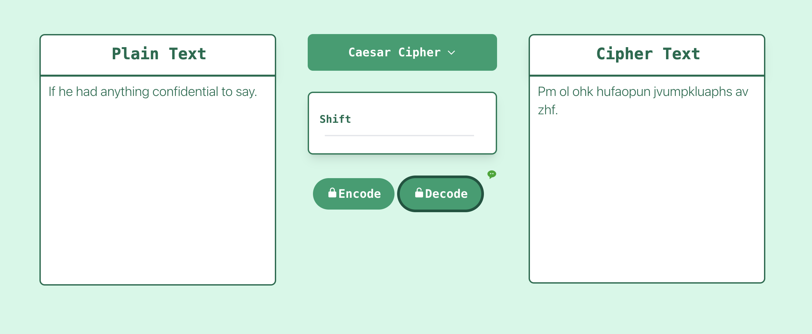
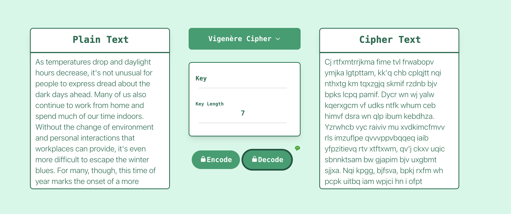
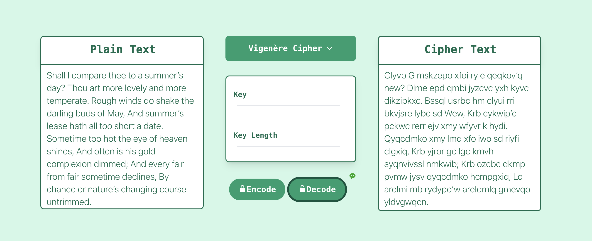

# [Crypto Monster](http://cryptoomonster.com/)

A website to encode and decode classical ciphers. Now have support 
1. Caesar Cipher
2. Linear Cipher
3. Vigenere Cipher




Our algorithm supports decoding without key. Note that the longer the ciphers, the better it works. 





For Vigenere Cipher, you can choos to decode just with the length of the key or even nothing.





## Deployment
### Backend
The backend is hosted on AWS Lambda and AWS API Gateway. We employ Zappa for deployment automation.

```bash
cd backend
pipenv shell
zappa update dev
```
